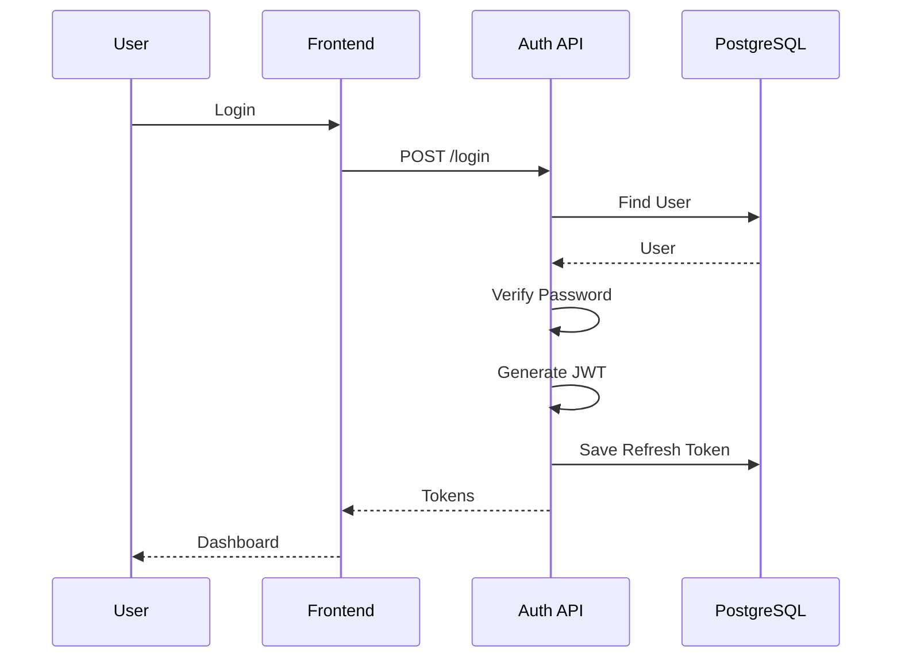
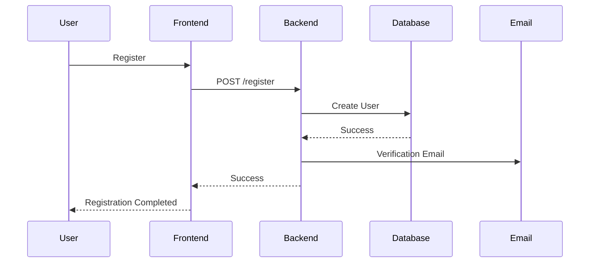
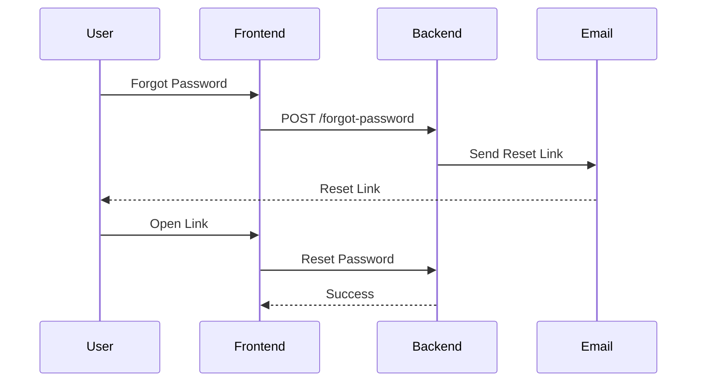
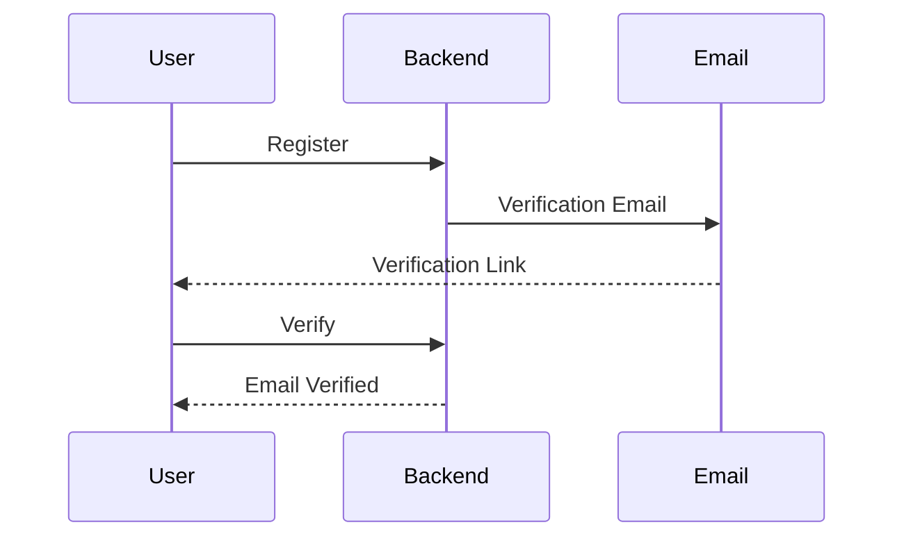

# 🔐 Authentication Module

> **Module:** Authentication
>
> **Project:** Zentra – AI-Powered Financial Operating System
>
> **Version:** 1.0.0
>
> **Status:** Planned
>
> **Priority:** P0 (Critical)
>
> **Owner:** Backend + Frontend
>
> **Related Documents**
>
> - product/03_requirements.md
> - api/authentication.md
> - database/database.md
> - security/authentication.md
> - security/jwt.md
> - llm/backend_rules.md

---

# Table of Contents

1. Overview
2. Objectives
3. Scope
4. Out of Scope
5. Business Value
6. Stakeholders
7. User Personas
8. User Stories
9. Functional Requirements
10. Non Functional Requirements

---

# 1. Overview

The Authentication module is responsible for securely identifying users, protecting financial information, and providing controlled access to every protected feature inside Zentra.

Authentication serves as the entry point to the application and forms the security foundation for:

- Dashboard
- Transactions
- Categories
- Budgets
- Goals
- AI Assistant
- Analytics
- Payment Initiation
- Notifications
- Profile Management

Every request that accesses user-specific financial data must pass through the authentication system.

The module follows modern authentication practices including JWT-based authentication, refresh token rotation, password hashing, secure session management, and role-ready authorization.

Although Zentra currently supports a single user role (User), the architecture must support future expansion to additional roles without requiring major refactoring.

---

# 2. Objectives

The authentication system shall provide the following capabilities:

## Primary Objectives

- Allow new users to create an account securely.
- Authenticate returning users.
- Protect all private APIs.
- Maintain user sessions.
- Prevent unauthorized access.
- Support password recovery.
- Verify email ownership.
- Securely store user credentials.

---

## Secondary Objectives

- Prepare for Google Login.
- Prepare for Apple Login.
- Prepare for Passkeys.
- Support multiple active devices.
- Support secure session invalidation.
- Allow future multi-factor authentication.

---

# 3. Scope

Authentication Version 1.0 includes the following features.

## Registration

Users can create a new account using:

- Full Name
- Email
- Password

---

## Login

Authenticate using:

- Email
- Password

---

## Logout

Terminate the active session.

---

## Refresh Token

Generate new access tokens without requiring users to log in repeatedly.

---

## Email Verification

Users must verify ownership of their email address.

---

## Forgot Password

Users may request a password reset link.

---

## Reset Password

Users may securely choose a new password.

---

## Current User

Return authenticated user's profile.

---

## Session Management

Support multiple logged-in devices.

---

# 4. Out of Scope

The following are intentionally excluded from Version 1.

- Google OAuth
- Apple Login
- GitHub Login
- OTP Login
- Passkeys
- Fingerprint Authentication
- Face ID
- Enterprise SSO
- Phone Number Login

These features belong to future versions and therefore must not influence Version 1 architecture.

---

# 5. Business Value

Authentication provides the identity layer for Zentra.

Without authentication the following features cannot exist:

- Personal Dashboard
- Expense Tracking
- Budgets
- Goals
- AI Chat
- Financial Reports
- Payment History
- Saved Preferences

Authentication also protects financial privacy by ensuring that users only access their own information.

---

# 6. Stakeholders

| Stakeholder | Responsibility |
|--------------|----------------|
| Guest | Register and login |
| User | Manage account |
| Backend | Validate authentication |
| Frontend | Maintain login state |
| PostgreSQL | Store users |
| AI Module | Personalize responses |
| Notification Service | Send verification emails |

---

# 7. User Personas

## Persona 1 — Student

Needs

- Easy registration
- Password recovery
- Persistent login

Pain Points

- Frequently forgets passwords
- Uses multiple devices

---

## Persona 2 — Working Professional

Needs

- Fast login
- Reliable sessions
- Strong security

Pain Points

- Uses work and personal devices
- Doesn't want repeated logins

---

## Persona 3 — Freelancer

Needs

- Access from multiple devices
- Strong account security
- Email verification

---

## Persona 4 — Future Premium User

Needs

- Better security
- Multi-device login
- Future MFA support

---

# 8. User Stories

## US-001

As a guest,

I want to register,

so that I can start managing my finances.

---

## US-002

As a registered user,

I want to log in,

so that I can access my financial dashboard.

---

## US-003

As a user,

I want my session to remain active,

so I don't need to log in repeatedly.

---

## US-004

As a user,

I want to log out,

so no one else can access my account.

---

## US-005

As a user,

I want to reset my password,

so I can recover my account if I forget it.

---

## US-006

As a user,

I want my email verified,

so my account remains secure.

---

# 9. Functional Requirements

---

## FR-001 User Registration

Description

The system shall allow a guest user to register a new account.

Priority

Critical

Input

- Name
- Email
- Password

Output

- User Created
- Verification Email Sent

Dependencies

- User Module
- Email Service

---

## FR-002 Login

Description

Authenticate users using email and password.

Returns

- Access Token
- Refresh Token
- User Information

---

## FR-003 Logout

Invalidate refresh token.

---

## FR-004 Refresh Token

Issue new access token.

---

## FR-005 Forgot Password

Generate secure reset token.

---

## FR-006 Reset Password

Validate token.

Update password.

---

## FR-007 Email Verification

Validate verification token.

Activate account.

---

## FR-008 Current User

Return authenticated user's profile.

---

# 10. Non Functional Requirements

## Performance

Login Response

< 500 ms

---

Register Response

< 700 ms

---

JWT Validation

< 20 ms

---

Availability

99.9%

---

Security

Passwords must never be stored in plain text.

Passwords must be hashed using bcrypt.

Refresh tokens must be hashed before storage.

HTTPS is mandatory in production.

---

Maintainability

The module shall follow Feature-Based Architecture.

Business logic shall remain inside the Service layer.

Database logic shall remain inside the Repository layer.

Controllers shall only process HTTP requests and responses.

---

Scalability

The authentication module shall support:

- 100,000 users
- Multiple active sessions
- Future authentication providers
- Future MFA integration

without major architectural changes.

---

# 11. Authentication Architecture

## Overview

The Authentication module follows Zentra's standard **Feature-Based Architecture**.

Every request passes through the following layers:

```text
Client
   │
   ▼
Routes
   │
   ▼
Validation Middleware
   │
   ▼
Controller
   │
   ▼
Service
   │
   ▼
Repository
   │
   ▼
PostgreSQL
```

Each layer has a single responsibility.

---

## Layer Responsibilities

### Routes

Responsibilities

- Register endpoints
- Attach middleware
- Version APIs

Example

```text
/auth/register

/auth/login

/auth/logout

/auth/refresh

/auth/forgot-password

/auth/reset-password

/auth/me
```

---

### Validation

Responsibilities

Validate

- Email
- Password
- Name
- Token
- Request Body

Validation happens before reaching the controller.

---

### Controller

Responsibilities

- Receive HTTP request
- Call service
- Return response

Controllers must NEVER:

- Query database
- Generate JWT
- Hash passwords
- Send emails

---

### Service

Responsibilities

Business logic lives here.

Examples

- Register User
- Login
- Generate JWT
- Verify Password
- Generate Reset Token
- Verify Email
- Rotate Refresh Token

---

### Repository

Responsibilities

Only database interaction.

Allowed

- SELECT
- INSERT
- UPDATE
- DELETE (Soft Delete if applicable)

Repositories never contain business logic.

---

# 12. Folder Structure

```text
backend/

src/

modules/

auth/

├── auth.controller.js

├── auth.service.js

├── auth.repository.js

├── auth.routes.js

├── auth.validation.js

├── auth.middleware.js

├── auth.constants.js

├── auth.utils.js

└── auth.docs.md
```

---

# 13. Database Design

Authentication uses two primary tables.

---

## users

Stores account information.

| Column | Type | Description |
|----------|------|-------------|
| id | UUID | Primary Key |
| full_name | VARCHAR(100) | User Name |
| email | VARCHAR(255) | Unique Email |
| password_hash | TEXT | Hashed Password |
| email_verified | BOOLEAN | Verification Status |
| profile_picture | TEXT | Optional |
| created_at | TIMESTAMP | Created |
| updated_at | TIMESTAMP | Updated |

---

## refresh_tokens

Stores active sessions.

| Column | Type |
|----------|------|
| id | UUID |
| user_id | UUID |
| token_hash | TEXT |
| expires_at | TIMESTAMP |
| device_name | VARCHAR |
| ip_address | VARCHAR |
| created_at | TIMESTAMP |

One user can have multiple refresh tokens.

This supports multiple devices.

---

# 14. Relationships

```text
users

1

↓

∞

refresh_tokens
```

---

# 15. Authentication APIs

## Register

```http
POST /api/v1/auth/register
```

Request

```json
{
    "fullName":"Ayush Kumar",
    "email":"ayush@gmail.com",
    "password":"StrongPassword@123"
}
```

Success Response

```json
{
    "success":true,
    "message":"User registered successfully.",
    "data":{
        "userId":"uuid"
    }
}
```

---

## Login

```http
POST /api/v1/auth/login
```

Request

```json
{
    "email":"ayush@gmail.com",
    "password":"StrongPassword@123"
}
```

Response

```json
{
  "success": true,
  "message": "Login successful",
  "data": {
    "accessToken": "...",
    "refreshToken": "...",
    "user": {
      "id": "...",
      "name": "Ayush Kumar"
    }
  }
}
```

---

## Logout

```http
POST /api/v1/auth/logout
```

Headers

```
Authorization: Bearer ACCESS_TOKEN
```

---

## Refresh Token

```http
POST /api/v1/auth/refresh
```

Body

```json
{
  "refreshToken":"..."
}
```

Returns

New Access Token

---

## Forgot Password

```http
POST /api/v1/auth/forgot-password
```

Body

```json
{
    "email":"ayush@gmail.com"
}
```

---

## Reset Password

```http
POST /api/v1/auth/reset-password
```

Body

```json
{
  "token":"...",
  "password":"NewPassword@123"
}
```

---

## Current User

```http
GET /api/v1/auth/me
```

Headers

```
Authorization: Bearer ACCESS_TOKEN
```

Returns current authenticated user.

---

# 16. Authentication Flow

```text
User

↓

Register

↓

Email Verification

↓

Login

↓

JWT Generated

↓

Protected APIs

↓

Access Token Expires

↓

Refresh Token

↓

New Access Token

↓

Continue Session
```

---

# 17. Login Sequence Diagram



---

# 18. Registration Sequence Diagram



---

# 19. JWT Strategy

Two tokens are used.

## Access Token

Purpose

Authentication

Expiry

15 Minutes

Stored

Memory

---

## Refresh Token

Purpose

Generate New Access Token

Expiry

30 Days

Stored

HttpOnly Cookie (Web)

Secure Storage (Flutter)

---

JWT Payload

```json
{
  "userId":"uuid",
  "email":"user@email.com"
}
```

Never include:

- Password
- Role Permissions
- Sensitive Information

---

# 20. Validation Rules

Validation is the first layer of defense against invalid or malicious input.

Every request entering the Authentication module **must** pass through the validation layer before reaching the controller.

Validation logic must never be implemented inside controllers.

---

## Registration Validation

### Full Name

| Rule | Value |
|------|-------|
| Required | Yes |
| Minimum Length | 2 |
| Maximum Length | 100 |
| Trim Whitespace | Yes |
| Allow Numbers | No |
| Allow Special Characters | Apostrophe (') and Hyphen (-) only |

Examples

✅ Ayush Kumar

✅ John Doe

❌ 12345

❌ @Ayush

---

### Email

Rules

- Required
- Valid email format
- Convert to lowercase
- Trim whitespace
- Must be unique
- Maximum length: 254 characters

Accepted

```
user@gmail.com
```

Rejected

```
usergmail.com

user@

@gmail.com
```

---

### Password

Rules

- Required
- Minimum 8 characters
- Maximum 128 characters
- At least one uppercase letter
- At least one lowercase letter
- At least one number
- At least one special character

Examples

✅ StrongPass@123

❌ password

❌ PASSWORD123

❌ 12345678

---

## Login Validation

Validate

- Email
- Password

Do not reveal whether

- Email exists
- Password is incorrect

Always return

```
Invalid email or password.
```

This prevents user enumeration attacks.

---

## Forgot Password Validation

Input

```
Email
```

Response

Always return

```
If an account exists, a password reset email has been sent.
```

Never reveal whether the email exists.

---

## Reset Password Validation

Validate

- Reset Token
- Password

Reject

- Expired Token
- Used Token
- Invalid Token

---

# 21. Business Rules

The Authentication module follows the business rules below.

---

## BR-001

Every email address must be unique.

---

## BR-002

Passwords are never stored in plaintext.

Only bcrypt hashes are stored.

---

## BR-003

Email verification is mandatory before accessing financial features.

Allowed before verification

- Login
- Logout
- Verify Email
- Resend Verification Email

Blocked before verification

- Dashboard
- Transactions
- Budgets
- AI Chat
- Payments

---

## BR-004

A user may have multiple active sessions.

Example

Laptop

Mobile

Tablet

All three are valid.

---

## BR-005

Each refresh token belongs to exactly one session.

---

## BR-006

Refresh Tokens rotate after every successful refresh request.

Old refresh token becomes invalid.

---

## BR-007

Password reset invalidates every active session.

Reason

If password changes because of compromise,

every logged-in device must be logged out.

---

## BR-008

JWT Access Tokens are stateless.

Server does not store access tokens.

---

# 22. Session Management

Each login creates a new session.

Example

```
Ayush

↓

Laptop Login

↓

Session A

↓

Mobile Login

↓

Session B

↓

Tablet Login

↓

Session C
```

Database

```
refresh_tokens

Session A

Session B

Session C
```

Logout from Mobile

↓

Delete Session B

Laptop remains logged in.

Tablet remains logged in.

---

# 23. Password Reset Flow



---

# 24. Email Verification Flow



---

# 25. Security Design

Authentication follows the OWASP Authentication Cheat Sheet.

Security Measures

- bcrypt Password Hashing
- JWT Authentication
- Refresh Token Rotation
- Input Validation
- Rate Limiting
- HTTPS
- Secure Headers
- SQL Injection Prevention
- XSS Prevention
- CSRF Protection (if cookies are used)

---

## Password Hashing

Algorithm

```
bcrypt
```

Salt Rounds

```
12
```

Passwords are never reversible.

---

## JWT

Access Token

Expiry

```
15 Minutes
```

Refresh Token

Expiry

```
30 Days
```

JWT Payload

```json
{
    "userId":"uuid",
    "email":"user@email.com"
}
```

Never include

- Password
- Permissions
- Sensitive Data

---

## Rate Limiting

Authentication endpoints require stricter limits.

Example

| Endpoint | Limit |
|-----------|-------|
| Login | 5/minute |
| Register | 5/minute |
| Forgot Password | 3/minute |
| Reset Password | 3/minute |

---

## Account Lockout

After

```
5 Failed Logins
```

Account enters temporary cooldown.

Cooldown

```
15 Minutes
```

Future versions may implement progressive delays instead of fixed lockouts.

---

# 26. Error Handling

| Status | Description |
|---------|-------------|
| 400 | Validation Failed |
| 401 | Invalid Credentials |
| 403 | Email Not Verified |
| 404 | User Not Found |
| 409 | Email Already Exists |
| 429 | Too Many Requests |
| 500 | Internal Server Error |

---

## Standard Error Response

```json
{
    "success": false,
    "message": "Validation failed.",
    "errors": [
        {
            "field": "email",
            "message": "Invalid email format."
        }
    ]
}
```

Every API must return errors using this format.

---

# 27. Edge Cases

The Authentication module must correctly handle the following situations.

### Registration

- Duplicate email
- Invalid email
- Weak password
- Extremely long input

---

### Login

- Wrong password
- Wrong email
- Deleted account
- Unverified email

---

### Refresh Token

- Expired token
- Tampered token
- Reused token
- Logged out session

---

### Password Reset

- Expired reset token
- Used reset token
- Invalid token

---

### Email Verification

- Expired verification link
- Already verified
- Invalid verification token

---

### Sessions

- User logs in from multiple devices.
- User changes password.
- User logs out from one device.
- User logs out from every device.

---

# 28. Testing Strategy

Authentication is a security-critical module. Every release must pass unit, integration, security, and performance testing before deployment.

---

## Unit Testing

### Controller Tests

- Register endpoint
- Login endpoint
- Logout endpoint
- Refresh endpoint
- Forgot Password endpoint
- Reset Password endpoint
- Current User endpoint

---

### Service Tests

- Password hashing
- Password verification
- JWT generation
- Refresh token generation
- Email verification token
- Password reset token

---

### Repository Tests

- Create user
- Find user by email
- Find user by ID
- Save refresh token
- Delete refresh token
- Delete all user sessions

---

## Integration Testing

### Registration Flow

```text
Register

↓

Email Verification

↓

Login

↓

Dashboard
```

---

### Login Flow

```text
User Login

↓

JWT Generated

↓

Access Protected API

↓

Refresh Token

↓

Logout
```

---

### Password Reset Flow

```text
Forgot Password

↓

Email

↓

Reset Link

↓

Password Changed

↓

Login
```

---

## Security Testing

Perform the following tests before every release.

### SQL Injection

Attempt malicious inputs.

Expected Result

```
Rejected
```

---

### XSS

Inject HTML or JavaScript.

Expected Result

```
Sanitized
```

---

### JWT Tampering

Modify payload.

Expected Result

```
401 Unauthorized
```

---

### Expired JWT

Use expired token.

Expected Result

```
401 Unauthorized
```

---

### Refresh Token Replay

Reuse old refresh token after rotation.

Expected Result

```
401 Unauthorized
```

---

### Brute Force Login

Repeated login attempts.

Expected Result

```
429 Too Many Requests
```

---

# 29. Performance Requirements

The authentication module should remain responsive under normal production load.

| Operation | Target |
|------------|---------|
| Register | < 700 ms |
| Login | < 500 ms |
| Logout | < 300 ms |
| Refresh Token | < 300 ms |
| Current User | < 200 ms |

---

## Scalability Goals

The module should support:

- 100,000 registered users
- 10,000 concurrent sessions
- Multiple active devices
- Future MFA support

without architectural changes.

---

# 30. Monitoring & Logging

Authentication events must be logged for auditing and debugging.

### Log Events

- User Registered
- Login Success
- Login Failure
- Logout
- Password Reset Requested
- Password Reset Completed
- Email Verified
- Refresh Token Issued
- Refresh Token Revoked

---

## Never Log

The following information must never appear in logs.

- Password
- Password Hash
- JWT
- Refresh Token
- Verification Token
- Reset Token

---

# 31. Future Enhancements

The authentication module is designed to support future improvements without major refactoring.

### Version 1.1

- Remember Me
- Session Management UI
- Resend Verification Email

---

### Version 2.0

- Google OAuth
- Apple Sign-In
- GitHub Login

---

### Version 3.0

- Multi-Factor Authentication (MFA)
- Time-based OTP (TOTP)
- SMS OTP
- Email OTP

---

### Version 4.0

- Passkeys (WebAuthn)
- Face ID
- Fingerprint Login
- Biometric Flutter Authentication

---

# 32. Coding Standards

Every authentication-related file must follow these standards.

---

## Controller

Responsibilities

- Receive request
- Call service
- Return response

Controllers must never:

- Execute SQL
- Hash passwords
- Generate JWT
- Send emails

---

## Service

Responsibilities

- Business logic
- JWT generation
- Password verification
- Session management

---

## Repository

Responsibilities

- Database queries only

Repositories must never:

- Validate business rules
- Generate tokens

---

## Validation

Every endpoint must have a dedicated validation schema.

---

## Response Format

Every API response must follow the standard Zentra response format.

### Success Response

```json
{
  "success": true,
  "message": "Login successful.",
  "data": {}
}
```

---

### Error Response

```json
{
  "success": false,
  "message": "Validation failed.",
  "errors": [
    {
      "field": "email",
      "message": "Invalid email."
    }
  ]
}
```

---

# 33. LLM Implementation Notes

The following rules are mandatory for any AI assistant generating code for this module.

## Architecture

- Use JavaScript only.
- Do not use TypeScript.
- Follow feature-based architecture.
- Follow Controller → Service → Repository pattern.

---

## Security

- Hash passwords with bcrypt.
- Hash refresh tokens before storing.
- Never expose password hashes.
- Never hardcode secrets.
- Load secrets from environment variables.

---

## Database

- Use PostgreSQL.
- Do not use MongoDB.
- Use UUIDs as primary keys.
- Use parameterized queries.

---

## API

- Keep responses consistent.
- Return proper HTTP status codes.
- Validate all request bodies.
- Never leak sensitive information.

---

## Frontend

- Store access token securely.
- Do not store refresh tokens in localStorage.
- Handle token expiry gracefully.
- Redirect unauthenticated users to login.

---

## Code Quality

- Keep controllers thin.
- Write reusable services.
- Avoid duplicate logic.
- Use descriptive variable names.
- Write comments only where necessary.
- Follow project coding standards.

---

# 34. Definition of Done

The Authentication module is considered complete only when all the following conditions are met.

## Backend

- User registration implemented
- Login implemented
- Logout implemented
- Refresh token implemented
- Forgot password implemented
- Reset password implemented
- Email verification implemented
- Current user endpoint implemented

---

## Database

- Tables created
- Constraints applied
- Indexes created
- Foreign keys configured

---

## Frontend

- Login page
- Register page
- Forgot password page
- Reset password page
- Authentication context
- Protected routes

---

## Security

- Password hashing
- JWT authentication
- Refresh token rotation
- Rate limiting
- Input validation
- HTTPS support

---

## Testing

- Unit tests passed
- Integration tests passed
- Security tests passed
- API tests passed

---

## Documentation

- Feature document completed
- API documentation completed
- Database documentation completed
- Security documentation completed

---

# 35. References

## Product Documentation

- `docs/product/03_requirements.md`
- `docs/product/04_features.md`

---

## API Documentation

- `docs/api/authentication.md`

---

## Database Documentation

- `docs/database/database.md`
- `docs/database/tables.md`

---

## Security Documentation

- `docs/security/authentication.md`
- `docs/security/jwt.md`
- `docs/security/best_practices.md`

---

## LLM Documentation

- `docs/llm/03_backend_rules.md`
- `docs/llm/07_api_rules.md`
- `docs/llm/09_coding_guidelines.md`

---

# Document Information

| Field | Value |
|--------|-------|
| Document | Authentication Module Specification |
| Version | 1.0.0 |
| Status | Planned |
| Priority | P0 |
| Owner | Backend Team |
| Last Updated | Initial Draft |
| Review Frequency | Before Each Major Release |

---

> **This document serves as the complete implementation specification for the Authentication module in Zentra. Every backend API, frontend screen, database table, validation rule, security measure, and test case related to authentication must conform to this specification.**