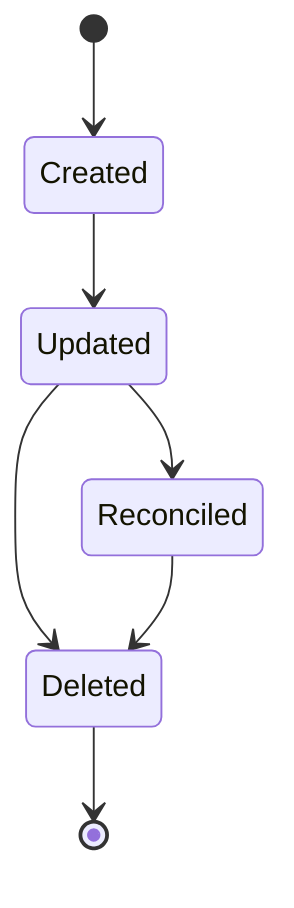
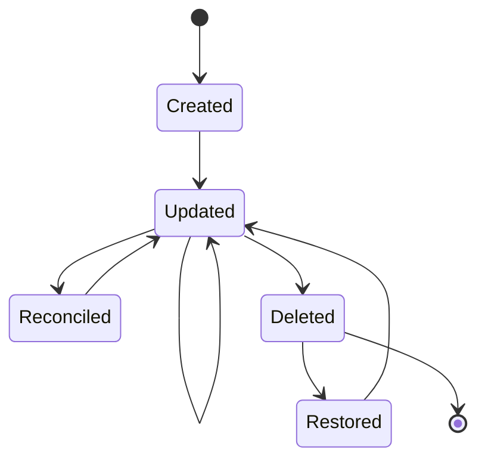
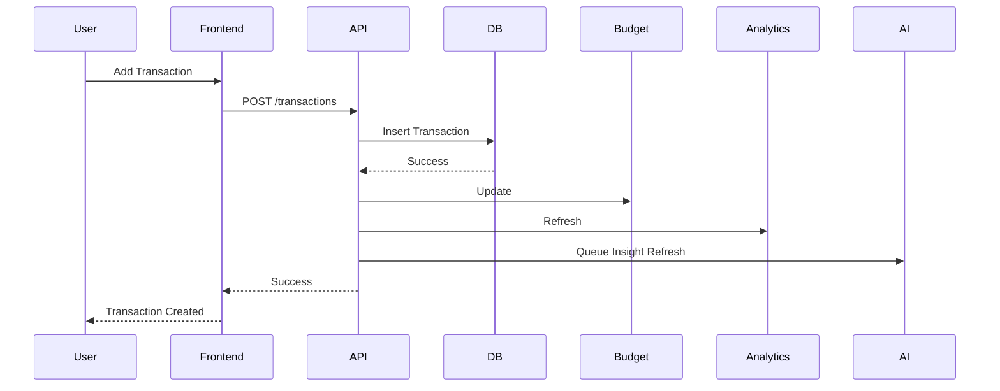
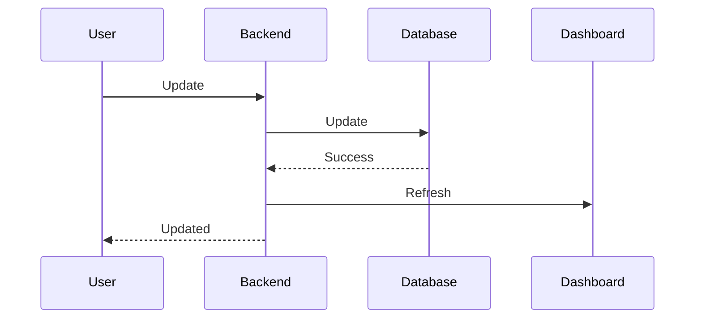
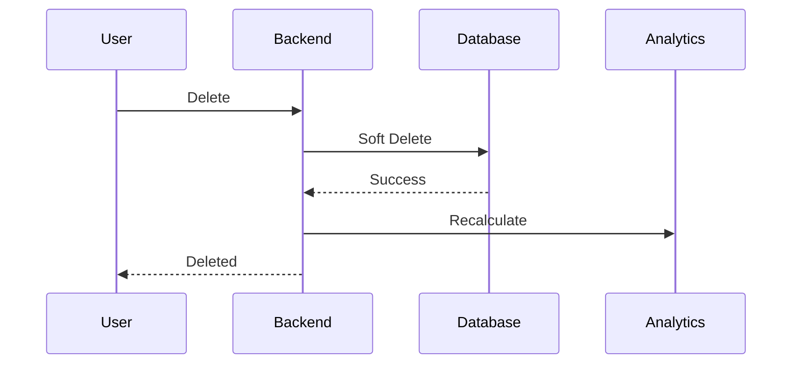

# Feature Specification: Transactions
---
title: Transactions Module

module: transactions

version: 1.0.0

priority: P0

status: Planned

owner: Backend Team

frontend:
  - Dashboard
  - Transactions
  - Add Transaction
  - Edit Transaction
  - Transaction Details

backend:
  - transactions

database:
  - transactions
  - transaction_categories
  - payment_intents

apis:
  - GET /transactions
  - POST /transactions
  - PATCH /transactions/:id
  - DELETE /transactions/:id

dependencies:
  - Authentication
  - Categories
  - Budgets
  - Analytics

related_docs:
  - api/transactions.md
  - database/tables.md
  - features/categories.md
  - features/budgets.md
---

# Transactions Module

> **Project:** Zentra – AI Powered Financial Operating System

Version: 1.0.0

Priority: P0

Status: Planned

---

# Table of Contents

1. Overview
2. Objectives
3. Scope
4. Out of Scope
5. Business Value
6. Stakeholders
7. User Personas
8. User Stories
9. Functional Requirements
10. Non Functional Requirements

---

# 1. Overview

The Transactions module is the core of Zentra.

Every financial insight generated by the application originates from transaction data.

Transactions are used by:

- Dashboard
- Budget System
- Goal Tracking
- Analytics
- AI Assistant
- AI Insights
- CSV Import
- SMS Import
- Payment Reconciliation
- Reports

No other module owns financial records.

Every expense or income inside Zentra must be represented as a Transaction.

---

# 2. Objectives

The module shall provide:

- Transaction Management
- Expense Tracking
- Income Tracking
- Search
- Filtering
- Sorting
- Pagination
- Soft Delete
- Category Assignment
- Merchant Tracking
- Payment Method Tracking
- Attachment Support (Future)
- AI Categorization (Future)

---

# 3. Scope

Version 1 includes:

✅ Manual Transaction Entry

✅ Edit Transaction

✅ Delete Transaction

✅ Search

✅ Filter

✅ Pagination

✅ Category Assignment

✅ Merchant Name

✅ Notes

✅ Payment Method

✅ Transaction Tags

✅ CSV Imported Transactions

✅ SMS Suggested Transactions

✅ Payment Reconciliation

---

# 4. Out of Scope

Version 1 excludes

- OCR Receipt Scanning
- Voice Transactions
- AI Auto Categorization
- Split Expenses
- Shared Transactions
- Investment Transactions
- Cryptocurrency

---

# 5. Business Value

Transactions are the single source of truth for the user's financial history.

Every report, chart, budget, and AI recommendation is derived from transaction records.

Without accurate transaction management, Zentra cannot deliver meaningful financial insights.

---

# 6. Stakeholders

| Stakeholder | Responsibility |
|-------------|---------------|
| User | Manage transactions |
| Backend | Validate and store data |
| Database | Persist transaction records |
| Dashboard | Display summaries |
| AI Module | Generate insights |
| Budget Module | Monitor spending |
| Analytics | Build reports |

---

# 7. User Personas

## Student

Needs

- Fast expense entry
- Budget tracking
- Daily spending overview

---

## Working Professional

Needs

- Search
- Filters
- Monthly reports
- Category management

---

## Freelancer

Needs

- Income tracking
- Expense tracking
- Cash flow visibility

---

## Small Business Owner

Needs

- Merchant history
- Daily records
- Monthly summaries

---

# 8. User Stories

## US-101

As a user,

I want to create a transaction,

so I can track my spending.

---

## US-102

As a user,

I want to edit transactions,

so mistakes can be corrected.

---

## US-103

As a user,

I want to delete unwanted transactions,

so my records stay clean.

---

## US-104

As a user,

I want to search by merchant,

so I can quickly find purchases.

---

## US-105

As a user,

I want to filter by category,

so I can analyze spending.

---

## US-106

As a user,

I want transactions imported from CSV,

so I don't manually enter everything.

---

## US-107

As a user,

I want SMS transaction suggestions,

so I can confirm detected expenses quickly.

---

## US-108

As a user,

I want UPI payment intents linked to transactions,

so payments and expenses stay synchronized.

---

# 9. Functional Requirements

---

## FR-201 Create Transaction

The system shall allow authenticated users to create a transaction.

Input

- Amount
- Type
- Category
- Merchant
- Payment Method
- Date
- Notes
- Tags

Output

Transaction Created

Dashboard Updated

Analytics Updated

Budget Updated

---

## FR-202 Update Transaction

Allow modification of:

- Amount
- Category
- Merchant
- Date
- Notes
- Tags

System must automatically recalculate:

- Dashboard
- Budgets
- Analytics
- AI summaries

---

## FR-203 Delete Transaction

Transactions are never permanently deleted.

Soft delete only.

Reason

Financial history should remain recoverable.

---

## FR-204 Search

Users can search by:

- Merchant
- Notes
- Category
- Tags

---

## FR-205 Filter

Support filters:

- Date Range
- Category
- Payment Method
- Income
- Expense
- Amount Range
- Import Source
- Merchant

---

## FR-206 Sorting

Sort by

- Date
- Amount
- Merchant
- Category
- Recently Added

Ascending & Descending

---

## FR-207 Pagination

Default

20 Transactions

Maximum

100 per page

---

## FR-208 Import Source

Every transaction stores its source.

Possible values

- Manual
- CSV
- SMS
- UPI
- Future API Integration

---

## FR-209 Duplicate Detection

The system shall detect potential duplicate transactions based on configurable rules such as:

- Same amount
- Same transaction type
- Similar merchant name
- Transaction timestamp within a configurable time window

Potential duplicates must be presented to the user for confirmation. The system must not automatically merge or delete transactions.

---

# 10. Non Functional Requirements

Performance

Create Transaction

<300 ms

Search

<500 ms

Pagination

<300 ms

Dashboard Update

<1 second

---

Availability

99.9%

---

Scalability

Support

- 1 Million Transactions

- 100,000 Users

without redesign.

---

Maintainability

Use Feature-Based Architecture.

Repository Pattern.

Reusable Validation.

Centralized Error Handling.

---

# 11. Transaction Architecture

## Overview

The Transactions module is the core domain of Zentra.

Every financial operation eventually creates, modifies, or references a transaction.

The module follows Zentra's standard Feature-Based Architecture.

```
Client
    │
    ▼
Routes
    │
    ▼
Validation Middleware
    │
    ▼
Controller
    │
    ▼
Service
    │
    ▼
Repository
    │
    ▼
PostgreSQL
```

---

## Layer Responsibilities

### Routes

Responsibilities

- Register API endpoints
- Apply authentication middleware
- Apply validation middleware

Routes never contain business logic.

---

### Controller

Responsibilities

- Receive HTTP request
- Call service layer
- Return standardized response

Controllers must never:

- Execute SQL
- Calculate analytics
- Update budgets
- Detect duplicates

---

### Service

Responsibilities

Business logic resides here.

Examples

- Create Transaction
- Update Transaction
- Delete Transaction
- Search
- Filter
- Duplicate Detection
- Budget Update Trigger
- Analytics Update Trigger

---

### Repository

Responsibilities

Only database operations.

Allowed

- SELECT
- INSERT
- UPDATE
- Soft Delete

Repositories must never contain business logic.

---

# 12. Folder Structure

```
backend/

src/

modules/

transactions/

├── transaction.controller.js
├── transaction.service.js
├── transaction.repository.js
├── transaction.routes.js
├── transaction.validation.js
├── transaction.constants.js
├── transaction.middleware.js
├── transaction.utils.js
└── transaction.docs.md
```

---

# 13. Database Design

Transactions use a normalized database structure.

Primary Tables

- transactions
- categories
- payment_intents
- transaction_tags
- transaction_tag_map

Future

- receipts
- attachments
- recurring_transactions

---

# 14. Transactions Table

## Purpose

Stores every financial record created by the user.

---

| Column | Type | Description |
|---------|------|-------------|
| id | UUID | Primary Key |
| user_id | UUID | Owner |
| category_id | UUID | Category |
| amount | NUMERIC(12,2) | Positive Amount |
| type | ENUM | income / expense |
| merchant | VARCHAR(255) | Merchant Name |
| payment_method | ENUM | Cash / UPI / Card / Bank |
| currency | CHAR(3) | Default INR |
| notes | TEXT | Optional |
| source | ENUM | Manual / CSV / SMS / UPI |
| transaction_date | TIMESTAMP | Actual Date |
| is_deleted | BOOLEAN | Soft Delete |
| created_at | TIMESTAMP | Created |
| updated_at | TIMESTAMP | Updated |

---

## Design Principles

Amount is **always positive**.

Example

```
Income

₹5000

Expense

₹5000
```

Direction comes from

```
type
```

instead of storing negative values.

Reason

This greatly simplifies

- Analytics

- Filtering

- Reporting

- SQL Aggregations

---

# 15. Categories Relationship

```
categories

1

↓

∞

transactions
```

One category

Many transactions

---

# 16. Transaction Tags

Users may optionally assign tags.

Examples

```
Vacation

Office

Medical

Family

Food

Fuel
```

Database

```
transaction_tags

id

name

color
```

Mapping

```
transaction_tag_map

transaction_id

tag_id
```

Many-to-many relationship.

---

# 17. Payment Intent Relationship

Transactions optionally connect to payments.

```
transactions

1

↓

0..1

payment_intents
```

Not every transaction originates from a payment.

Example

Salary

↓

No Payment Intent

Restaurant Payment

↓

Payment Intent Exists

---

# 18. Import Sources

Every transaction stores its origin.

Possible values

```
MANUAL

CSV

SMS

UPI

API
```

Benefits

- Analytics

- Duplicate Detection

- Import History

- Reconciliation

---

# 19. Soft Delete Strategy

Transactions are never permanently deleted.

Instead

```
is_deleted = true
```

Reasons

- Preserve history

- Auditability

- Restore deleted data

- Maintain referential integrity

All queries must automatically exclude deleted transactions unless explicitly requested.

---

# 20. Indexing Strategy

Indexes are critical because transactions are queried frequently.

Primary Indexes

```
PRIMARY KEY (id)
```

---

Foreign Keys

```
user_id

category_id
```

---

Search Index

```
merchant
```

---

Date Index

```
transaction_date
```

---

Composite Index

```
(user_id, transaction_date)
```

---

Analytics Index

```
(user_id, category_id)
```

---

Future Full Text Search

```
merchant

notes
```

---

# 21. Constraints

## Amount

Must be

```
> 0
```

---

## Type

Allowed

```
income

expense
```

---

## Currency

Allowed

```
INR
```

Future

Multiple currencies.

---

## Merchant

Maximum

```
255 Characters
```

---

## Notes

Maximum

```
2000 Characters
```

---

# 22. Transaction States

```
Created

↓

Edited

↓

Reconciled

↓

Archived (Future)

↓

Soft Deleted
```

Transactions never enter a "Hard Deleted" state.

---

# 23. State Diagram



---

# 24. Data Ownership Rules

Every transaction belongs to exactly one user.

```
users

1

↓

∞

transactions
```

No transaction may be shared between users in Version 1.

Future versions may introduce:

- Family Accounts

- Shared Wallets

- Team Expenses

These features require a redesigned ownership model and are therefore out of scope for Version 1.

---

# 25. Audit Strategy

Every modification should be traceable.

Fields maintained automatically:

- created_at
- updated_at

Future enhancement:

A dedicated `transaction_history` table to record every update, including the changed fields, timestamp, and user responsible for the modification.

For Version 1, timestamps provide sufficient audit information while keeping the implementation simple.

---

# 26. API Specification

The Transactions module exposes RESTful APIs for managing financial transactions.

All endpoints require authentication unless explicitly stated.

Base URL

```
/api/v1/transactions
```

---

# Standard Response Format

## Success Response

```json
{
    "success": true,
    "message": "Transaction created successfully.",
    "data": {},
    "meta": {}
}
```

---

## Error Response

```json
{
    "success": false,
    "message": "Validation failed.",
    "errors": [
        {
            "field": "amount",
            "message": "Amount must be greater than zero."
        }
    ]
}
```

Every endpoint in Zentra must return responses using this format.

---

# 27. Create Transaction

## Endpoint

```http
POST /api/v1/transactions
```

---

## Description

Creates a new transaction for the authenticated user.

---

## Authentication

Required

```
Bearer Token
```

---

## Request Body

```json
{
    "amount": 250,
    "type": "expense",
    "categoryId": "uuid",
    "merchant": "Domino's",
    "paymentMethod": "UPI",
    "currency": "INR",
    "transactionDate": "2026-07-28T19:00:00Z",
    "notes": "Dinner with friends",
    "tags": [
        "Food",
        "Weekend"
    ]
}
```

---

## Success Response

```json
{
    "success": true,
    "message": "Transaction created successfully.",
    "data": {
        "transactionId": "uuid"
    }
}
```

---

## Side Effects

Creating a transaction automatically triggers:

- Dashboard refresh
- Budget recalculation
- Analytics recalculation
- AI insight refresh (background job)
- Notification evaluation

---

# 28. Get Transaction List

## Endpoint

```http
GET /api/v1/transactions
```

---

## Description

Returns paginated transaction history.

---

## Query Parameters

| Parameter | Description |
|------------|-------------|
| page | Page Number |
| limit | Records Per Page |
| sort | Sorting Field |
| order | asc / desc |
| search | Merchant / Notes |
| category | Category ID |
| type | income / expense |
| paymentMethod | Cash / UPI / Card |
| startDate | Start Date |
| endDate | End Date |

---

## Example

```http
GET /transactions?page=1&limit=20
```

---

## Response

```json
{
  "success": true,
  "data": {
    "transactions": [],
    "pagination": {
      "page": 1,
      "limit": 20,
      "totalRecords": 124,
      "totalPages": 7
    }
  }
}
```

---

# 29. Get Transaction Details

## Endpoint

```http
GET /api/v1/transactions/:id
```

---

Returns complete transaction details.

---

## Response

```json
{
    "success": true,
    "data": {
        "id": "uuid",
        "amount": 250,
        "merchant": "Domino's",
        "category": "Food",
        "paymentMethod": "UPI",
        "notes": "Dinner"
    }
}
```

---

# 30. Update Transaction

## Endpoint

```http
PATCH /api/v1/transactions/:id
```

---

Allowed Updates

- Amount
- Category
- Merchant
- Notes
- Date
- Tags
- Payment Method

---

## Request

```json
{
    "amount": 300,
    "notes": "Dinner with colleagues"
}
```

---

## Side Effects

Update

- Dashboard
- Budgets
- Analytics
- AI summaries

---

# 31. Delete Transaction

## Endpoint

```http
DELETE /api/v1/transactions/:id
```

---

Description

Soft deletes a transaction.

---

Database

```
is_deleted = true
```

No record is permanently removed.

---

# 32. Search Transactions

## Endpoint

```http
GET /api/v1/transactions/search
```

---

Example

```http
GET /transactions/search?q=dominos
```

Searches

- Merchant
- Notes
- Tags

Future

Full-text search.

---

# 33. Filter Transactions

## Endpoint

```http
GET /api/v1/transactions/filter
```

---

Supported Filters

Category

Payment Method

Date Range

Income

Expense

Import Source

Merchant

Amount Range

Tags

---

Example

```http
GET /transactions/filter?category=food&type=expense
```

---

# 34. Bulk Operations

## Endpoint

```http
POST /api/v1/transactions/bulk
```

Supports

- Bulk Delete
- Bulk Category Update
- Bulk Tag Update

---

Request

```json
{
    "transactionIds":[
        "uuid1",
        "uuid2"
    ],
    "action":"delete"
}
```

---

# 35. Import Status

Returns imported transactions.

```http
GET /api/v1/transactions/imports
```

---

Used by

CSV Module

SMS Module

---

# 36. Reconciliation API

## Endpoint

```http
POST /api/v1/transactions/reconcile
```

Purpose

Match

- CSV

- SMS

- UPI

with existing transactions.

---

Request

```json
{
    "transactionId":"uuid",
    "paymentIntentId":"uuid"
}
```

---

# 37. Duplicate Detection

## Endpoint

```http
POST /api/v1/transactions/detect-duplicates
```

Returns possible duplicate transactions.

Duplicates are scored using:

- Amount
- Merchant similarity
- Date proximity
- Payment method
- Source

Example Response

```json
{
  "success": true,
  "data": {
    "duplicates": [
      {
        "transactionId": "uuid",
        "confidence": 94
      }
    ]
  }
}
```

The system **must not** automatically merge or delete duplicates. User confirmation is always required.

---

# 38. Transaction Timeline

Future endpoint

```http
GET /api/v1/transactions/timeline
```

Returns

Daily grouped transactions.

Used for

Timeline View.

---

# 39. Export Transactions

Future

```http
GET /api/v1/transactions/export
```

Formats

CSV

Excel

PDF

---

# 40. API Security

Every endpoint requires

JWT Authentication

Ownership Validation

Input Validation

Rate Limiting

Audit Logging

---

# 41. Rate Limits

| Endpoint | Limit |
|-----------|-------|
| GET | 120 requests/minute |
| POST | 60 requests/minute |
| PATCH | 60 requests/minute |
| DELETE | 30 requests/minute |

---

# 42. API Versioning

Current Version

```
v1
```

Future

```
v2

v3
```

Older versions remain backward compatible until officially deprecated.

---

# 43. Idempotency

To prevent accidental duplicate submissions (for example, double-clicking the "Save" button or retrying after a network timeout), create/update operations should support an optional **Idempotency-Key** header.

Example:

```http
Idempotency-Key: 550e8400-e29b-41d4-a716-446655440000
```

If the same request with the same key is received again within the configured window, the server should return the original response instead of creating a duplicate transaction.

This is especially important for:

- Manual transaction creation
- CSV import batches
- Payment reconciliation

---

# 44. Validation Rules

Validation is performed before any business logic executes.

Validation must occur in the Validation Layer.

Controllers must never perform validation.

---

## Amount Validation

Rules

| Rule | Value |
|------|-------|
| Required | Yes |
| Type | Number |
| Minimum | ₹0.01 |
| Maximum | ₹999,99,99,999.99 |

Examples

✅ 250

✅ 1999.99

❌ 0

❌ -500

❌ "abc"

---

## Transaction Type

Allowed Values

```
income

expense
```

Invalid

```
salary

payment

credit
```

---

## Category

Rules

- Required
- Must exist
- Must belong to current user
- Cannot be deleted

---

## Merchant

Rules

Required

No

Minimum Length

0

Maximum Length

255

Trim Spaces

Yes

Allowed Characters

Unicode Text

Numbers

Special Characters

---

Examples

```
Domino's

Amazon

IRCTC

Swiggy

Rahul Kumar

State Bank of India
```

---

## Payment Method

Allowed

```
Cash

UPI

Debit Card

Credit Card

Net Banking

Wallet

Cheque

Other
```

---

## Currency

Version 1

```
INR
```

Future

Multi Currency

---

## Notes

Optional

Maximum Length

```
2000 Characters
```

---

## Transaction Date

Rules

Required

Cannot be NULL

Cannot exceed current time by more than 24 hours

---

## Tags

Maximum

```
20 Tags
```

Each tag

```
50 Characters
```

---

# 45. Business Rules

These rules define how transactions behave.

---

## BR-201

Amount is always positive.

Direction is determined by

```
type
```

---

## BR-202

Every transaction belongs to exactly one user.

No shared ownership.

---

## BR-203

Soft Delete Only.

No transaction is permanently deleted.

---

## BR-204

Updating a transaction automatically triggers

- Dashboard Refresh
- Budget Recalculation
- Analytics Update
- Goal Progress Evaluation
- AI Insight Refresh

---

## BR-205

Deleting a transaction automatically updates

- Dashboard
- Budgets
- Analytics
- Goals

---

## BR-206

Imported transactions cannot be modified until import validation completes.

---

## BR-207

Duplicate detection never automatically merges records.

User confirmation is mandatory.

---

## BR-208

Future dated transactions are allowed only up to

```
24 Hours
```

Used for scheduling and correcting delayed entries.

---

## BR-209

Currency cannot change after creation.

Future versions supporting multiple currencies will require currency conversion instead of direct updates.

---

# 46. User Flow

## Manual Transaction

```text
Dashboard

↓

Add Transaction

↓

Validation

↓

Create Transaction

↓

Update Dashboard

↓

Update Budgets

↓

Update Analytics

↓

Success
```

---

## Edit Transaction

```text
Transaction

↓

Edit

↓

Validation

↓

Update

↓

Recalculate

↓

Refresh Dashboard
```

---

## Delete Transaction

```text
Transaction

↓

Delete

↓

Confirmation

↓

Soft Delete

↓

Recalculate Dashboard

↓

Refresh UI
```

---

# 47. Transaction Lifecycle



---

# 48. Create Transaction Sequence Diagram



---

# 49. Update Transaction Sequence



---

# 50. Delete Transaction Sequence



---

# 51. Automatic System Events

Whenever a transaction changes, the system automatically evaluates the following modules.

| Module | Action |
|---------|--------|
| Dashboard | Refresh summary |
| Budgets | Recalculate utilization |
| Goals | Update progress |
| Analytics | Refresh charts |
| AI Insights | Queue regeneration |
| Notifications | Check budget alerts |
| Reports | Mark cached reports stale |

The user should not manually trigger these updates.

---

# 52. Duplicate Detection Strategy

Duplicate detection is based on a weighted confidence score.

Matching Factors

| Factor | Weight |
|----------|--------|
| Amount | 40% |
| Merchant Similarity | 25% |
| Date & Time | 20% |
| Payment Method | 10% |
| Source | 5% |

---

## Confidence Levels

| Score | Action |
|---------|--------|
| ≥95% | Show high-confidence duplicate warning |
| 80–94% | Suggest possible duplicate |
| <80% | No action |

---

The system **never**:

- Deletes duplicates automatically
- Merges duplicates automatically
- Modifies user data automatically

Final decision always belongs to the user.

---

# 53. Transaction Sources

Every transaction has one source.

Allowed Values

| Source | Description |
|---------|-------------|
| MANUAL | User entered manually |
| CSV | Imported from bank statement |
| SMS | Suggested from SMS parsing |
| UPI | Created after payment reconciliation |
| API | Future banking integration |

The source field is immutable after creation.

---

# 54. Transaction Categories

Every transaction must belong to exactly one category.

Examples

Income

- Salary
- Bonus
- Freelance
- Interest

Expense

- Food
- Travel
- Shopping
- Rent
- Utilities
- Entertainment
- Medical
- Education

Users may create custom categories.

System categories cannot be deleted.

---

# 55. Merchant Handling

Merchant names are stored exactly as entered or imported.

Examples

```
Rahul Kumar

Zomato

Amazon Seller Services

IRCTC

Indian Oil

UPI-PAYMENT
```

The system may normalize merchant names internally for analytics and duplicate detection, but the original value should be preserved for display and audit purposes.

---

# 56. Security Requirements

The Transactions module manages highly sensitive financial information. Every request must follow strict security practices.

---

## Authentication

All transaction endpoints require a valid JWT Access Token.

```
Authorization: Bearer <ACCESS_TOKEN>
```

Unauthenticated requests must return:

```http
401 Unauthorized
```

---

## Authorization

Every transaction belongs to exactly one user.

Before performing any operation, verify:

```text
transaction.user_id == authenticated_user.id
```

If not,

```http
403 Forbidden
```

must be returned.

---

## Input Validation

Every incoming request must be validated.

Validate:

- Amount
- Category
- Merchant
- Payment Method
- Currency
- Date
- Notes
- Tags

Never trust frontend validation.

---

## SQL Injection Protection

Use parameterized queries only.

Never build SQL like

```javascript
SELECT * FROM transactions WHERE id = '${id}'
```

Always use prepared statements.

---

## XSS Protection

Merchant

Notes

Tags

must be sanitized before rendering in the frontend.

---

## CSRF

If authentication uses cookies,

enable CSRF protection.

If JWT Authorization header is used,

CSRF is not required.

---

## Sensitive Data

Transactions never store

- Card Numbers
- CVV
- ATM PIN
- UPI PIN
- Bank Password

These are strictly prohibited.

---

# 57. Performance Requirements

The Transactions module is the most frequently accessed module.

Performance goals:

| Operation | Target |
|-----------|---------|
| Create | <300 ms |
| Update | <300 ms |
| Delete | <250 ms |
| Search | <500 ms |
| Filter | <500 ms |
| Dashboard Refresh | <1 sec |

---

## Large Dataset Performance

Support

```
1 Million Transactions
```

without redesign.

Strategies

- Database Indexes
- Pagination
- Lazy Loading
- Query Optimization
- Cached Analytics
- Background Processing

---

# 58. Error Handling

Standard error response

```json
{
    "success": false,
    "message": "Validation failed.",
    "errors": [
        {
            "field":"amount",
            "message":"Amount must be greater than zero."
        }
    ]
}
```

---

## Common Errors

| HTTP Code | Description |
|------------|-------------|
| 400 | Invalid Request |
| 401 | Unauthorized |
| 403 | Forbidden |
| 404 | Transaction Not Found |
| 409 | Duplicate Transaction |
| 422 | Validation Failed |
| 429 | Too Many Requests |
| 500 | Internal Server Error |

---

# 59. Audit Logging

Every important operation must generate an audit event.

Log

- Transaction Created
- Transaction Updated
- Transaction Deleted
- Duplicate Warning
- CSV Import
- SMS Confirmation
- Reconciliation Completed

---

Never log

- JWT
- Password
- Sensitive User Information

---

# 60. Notifications

Transaction events may trigger notifications.

Examples

Expense exceeds budget.

↓

Budget Alert

---

Large transaction.

↓

Security Notification

---

Goal achieved.

↓

Savings Notification

---

Notifications are asynchronous.

Never block transaction creation.

---

# 61. Testing Strategy

---

## Unit Tests

Controller

Service

Repository

Validation

Duplicate Detection

---

## Integration Tests

Create

↓

Dashboard Update

↓

Budget Update

↓

Analytics Update

---

Update

↓

Budget Refresh

↓

AI Refresh

---

Delete

↓

Soft Delete

↓

Dashboard Refresh

---

## API Tests

POST

PATCH

DELETE

GET

Search

Filter

Pagination

Bulk Operations

---

## Security Tests

JWT

Authorization

Ownership Validation

Rate Limiting

SQL Injection

XSS

---

## Performance Tests

100

1,000

10,000

100,000

Concurrent transactions

Measure

- API latency
- Database performance
- Query execution
- Cache efficiency

---

# 62. Future Enhancements

Version 1.1

- Bulk Edit
- Restore Deleted Transaction
- Duplicate Merge Assistant

---

Version 2

- OCR Receipt Scanner
- AI Auto Categorization
- Smart Merchant Detection
- Recurring Transactions

---

Version 3

- Shared Transactions
- Split Bills
- Family Accounts
- Investment Transactions
- Subscription Detection

---

# 63. LLM Implementation Notes

These rules are mandatory for AI-generated code.

---

## Architecture

Follow

```
Controller

↓

Service

↓

Repository
```

Never bypass layers.

---

## Database

Use PostgreSQL.

Never use MongoDB.

Always use UUID.

Always use foreign keys.

---

## Transactions

Amounts are always positive.

Income / Expense determined by

```
type
```

Never store negative values.

---

## Soft Delete

Never permanently delete.

Always use

```
is_deleted = true
```

---

## Dashboard

Every create/update/delete must trigger

- Dashboard Refresh

- Budget Update

- Analytics Refresh

- Goal Evaluation

- AI Insight Refresh

Do not duplicate this logic across controllers. Prefer an event-driven or service-orchestrated approach.

---

## Validation

Always validate

- Amount
- Category
- Merchant
- Payment Method

Never trust frontend validation.

---

## Search

Always paginate.

Never return unlimited records.

---

## Security

Never expose another user's transaction.

Always verify ownership.

---

## API

Use standardized response format.

Never return inconsistent JSON.

---

## Import Sources

Never modify

```
source
```

after creation.

---

## Duplicate Detection

Never merge automatically.

Always ask user.

---

# 64. Definition of Done

The Transactions module is complete only when:

## Backend

- Create Transaction
- Update Transaction
- Delete Transaction
- Search
- Filter
- Sort
- Pagination
- Duplicate Detection
- Import Source Support

---

## Frontend

- Transaction List
- Add Transaction
- Edit Transaction
- Delete Confirmation
- Search Bar
- Filter Panel
- Transaction Details

---

## Database

- Tables Created
- Indexes Added
- Foreign Keys Configured
- Constraints Applied

---

## Security

- JWT Authentication
- Ownership Validation
- Input Validation
- SQL Injection Prevention
- XSS Protection

---

## Performance

Supports

- 100k Users
- 1M Transactions

---

## Testing

- Unit Tests
- Integration Tests
- API Tests
- Security Tests
- Performance Tests

All passing.

---

## Documentation

Updated

- API Documentation
- Database Documentation
- Feature Documentation
- LLM Documentation

---

# 65. References

## Product

- `docs/product/03_requirements.md`
- `docs/product/04_features.md`

---

## Features

- `docs/features/categories.md`
- `docs/features/budgets.md`
- `docs/features/dashboard.md`
- `docs/features/payments.md`
- `docs/features/reconciliation.md`
- `docs/features/analytics.md`

---

## API

- `docs/api/transactions.md`

---

## Database

- `docs/database/database.md`
- `docs/database/tables.md`

---

## Security

- `docs/security/authentication.md`
- `docs/security/validation.md`

---

## LLM

- `docs/llm/backend_rules.md`
- `docs/llm/database_rules.md`
- `docs/llm/api_rules.md`

---

# Document Metadata

| Field | Value |
|--------|-------|
| Document | Transactions Module Specification |
| Version | 1.0.0 |
| Status | Planned |
| Priority | P0 |
| Owner | Backend Team |
| Last Updated | Initial Draft |
| Review Frequency | Every Major Release |

---

# Conclusion

The Transactions module is the foundation of Zentra.

Every financial operation—manual entry, CSV import, SMS parsing, payment reconciliation, AI insights, analytics, budgets, goals, and reports—depends on accurate transaction data.

This document serves as the single implementation contract for developers and AI coding assistants. Any change to transaction behavior must be reflected here before implementation.
